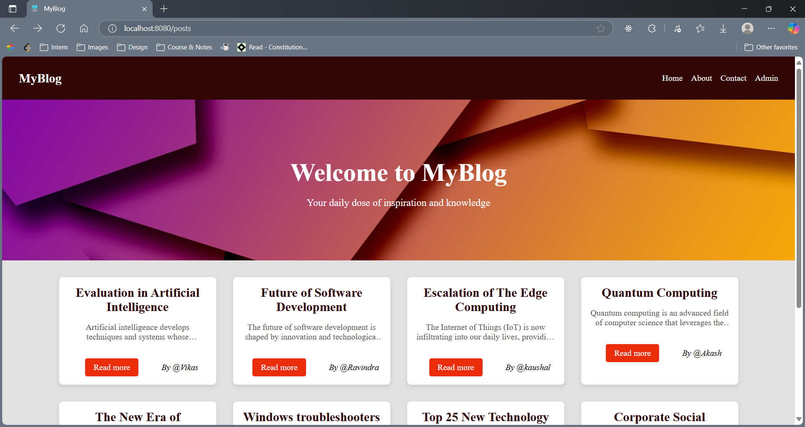
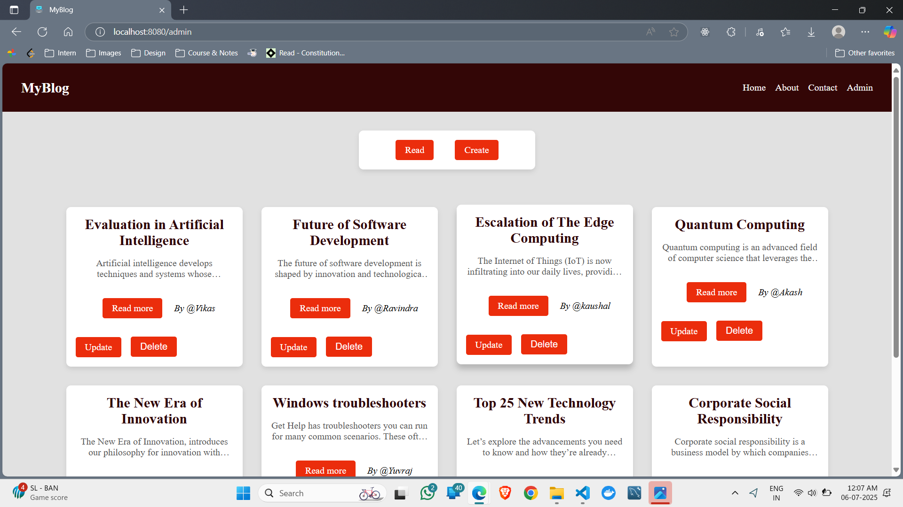
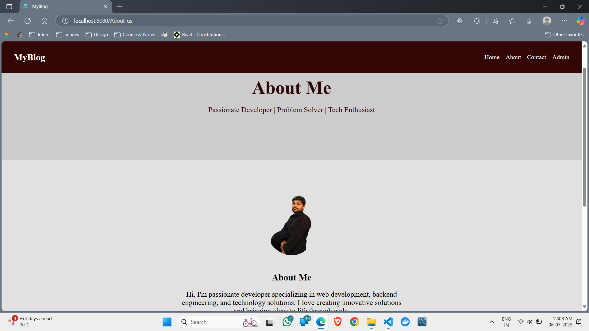
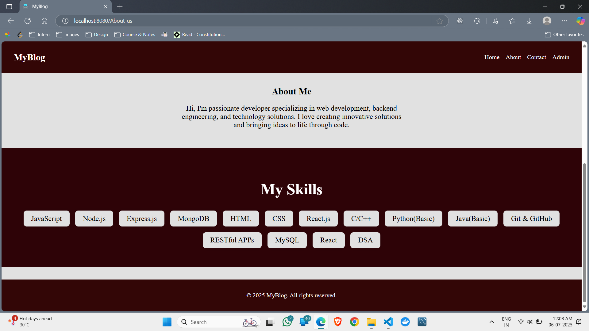
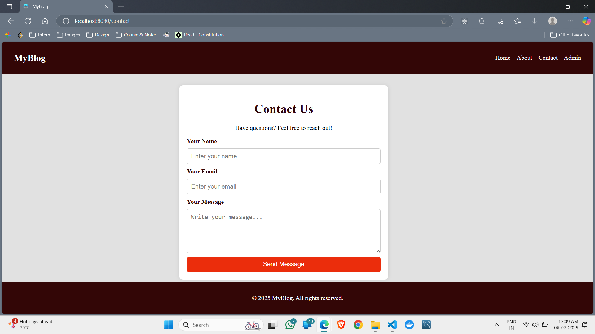

# 📝 MyBlog

A dynamic and responsive **Blog Web Application** built using **React.js**, **Express.js**, **Node.js**, and **MongoDB** (MERN Stack). This platform allows users to **create, read, update, and delete** blog posts with a seamless UI and secure backend.

## 🚀 Features

- ✍️ **Create Blog Posts** – Add titles, descriptions, and rich content
- 🗂️ **Categorize Posts** – Organize posts under custom tags
- 🔐 **User Authentication** – Register, log in, and manage sessions securely
- ✏️ **Update & Delete** – Only authors can edit or delete their own posts
- 📱 **Responsive Design** – Works flawlessly across devices
- 🌐 **RESTful API Integration** – Built with Express and MongoDB

---

## 🛠️ Tech Stack

| Frontend        | Backend         | Database  | Tools       |
|-----------------|------------------|-----------|-------------|
| React.js        | Node.js          | MongoDB   | Postman     |
| HTML, CSS, JS   | Express.js       | Mongoose  | Git & GitHub |
| Axios, React Router | bcrypt, JWT |           | VS Code     |

---

## 📸 Screenshots








## 📂 Folder Structure


MyBlog/
├── client/ # React frontend
│ ├── src/
│ │ ├── components/ # UI Components
│ │ ├── pages/ # Main page views
│ │ └── App.js
│ └── ...
├── server/ # Node.js backend
│ ├── routes/ # API routes
│ ├── models/ # Mongoose models
│ ├── controllers/ # Route logic
│ └── server.js
└── .env


---

## 📦 Installation & Setup

1. **Clone the repository**
```bash
git clone https://github.com/rroyalpradeep/MyBlog.git

cd MyBlog/server
npm install

cd ../client
npm install

MONGO_URL=your_mongodb_connection_string
JWT_SECRET=your_secret_key
PORT=5000

# In one terminal (for backend)
cd server
npm start

# In another terminal (for frontend)
cd client
npm start

🔐 Authentication
User passwords are hashed using bcrypt

Tokens are issued using JWT

Routes are protected and role-based actions are enforced (e.g., only post authors can edit/delete)

📌 To-Do / Improvements
Add WYSIWYG editor support

Comment system for blog posts

Rich image uploading and media support

Improve mobile responsiveness

Add user profile pages

🤝 Contributing
Contributions, issues and feature requests are welcome!
Feel free to open an issue or submit a pull request.

📄 License
This project is licensed under the MIT License.

🙋‍♂️ Author
Pradeep Soni
📧 pradeepsoniofficial@gmail.com
🔗 GitHub • LinkedIn
